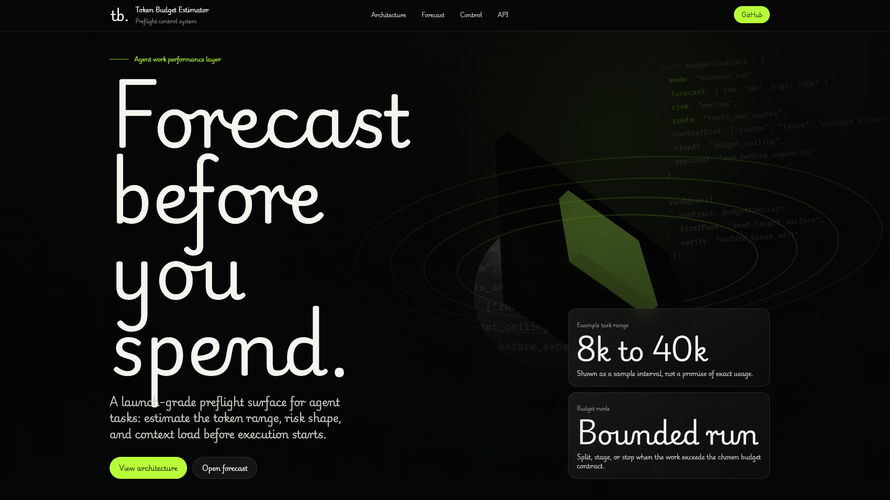

# Token Budget Estimator

A Codex skill and CLI utility for estimating full agent-task token usage before execution.

It predicts a token range for the whole task, including prompt text, repository discovery, file reads, command output, test failures, retry loops, intermediate analysis, and final response. It also supports risk levels, budget checks, context-window fit checks, cost estimates, project configuration, batch comparison, and historical calibration.

## Features

- Estimate full agent-task token ranges.
- Classify task type and complexity.
- Scan repository size signals.
- Estimate searches, file reads, commands, and retry loops.
- Report risk: `low`, `medium`, `high`, or `extreme`.
- Check a token budget with `--budget`.
- Check context-window fit with `--context-window`.
- Estimate cost from custom input/output token prices.
- Compare multiple tasks and rank them by estimated token usage.
- Optimize rough prompts into budget-aware Codex task contracts.
- Generate cheap, balanced, or thorough execution modes.
- Add scope guards, output caps, and auto-split plans for expensive tasks.
- Show before/after token estimates for optimized prompts.
- Generate a full preflight controller report with forecast, ROI, budget contract, and context diet plan.
- Load project defaults from `.token-budget.json`.
- Record actual usage samples for future calibration.
- Use as a Codex skill through `$token-budget-estimator`.

## Home Page

This repository includes a product home page at `site/index.html` and an API standard page at `site/api.html`.



Official Website: [https://yuk1207.github.io/token-budget-estimator/](https://yuk1207.github.io/token-budget-estimator/)
API Standard: [https://yuk1207.github.io/token-budget-estimator/api.html](https://yuk1207.github.io/token-budget-estimator/api.html)

Use it as the GitHub Pages entry point and public project home page. It introduces the skill's forecast, ROI, budget contract, context diet workflow, and API preflight control layer without requiring a backend.

## Installation

### Install As A Codex Skill

Copy this folder into your Codex skills directory:

```text
~/.codex/skills/token-budget-estimator
```

On Windows:

```text
C:\Users\<YOU>\.codex\skills\token-budget-estimator
```

The final layout should look like:

```text
token-budget-estimator/
|-- SKILL.md
|-- README.md
|-- agents/
|   `-- openai.yaml
|-- references/
|   |-- agents-preflight.md
|   |-- project-config.md
|   |-- risk-policy.md
|   |-- task-taxonomy.md
|   `-- token-model.md
`-- scripts/
    |-- estimate.py
    `-- test_estimate.py
```

Restart Codex or start a new Codex thread if the skill is not discovered immediately.

### Validate The Skill

If you have the Codex skill creator validation script available:

```powershell
python "C:\Users\<YOU>\.codex\skills\.system\skill-creator\scripts\quick_validate.py" "C:\Users\<YOU>\.codex\skills\token-budget-estimator"
```

Expected:

```text
Skill is valid!
```

### Run Tests

```powershell
cd "C:\Users\<YOU>\.codex\skills\token-budget-estimator\scripts"
python -m unittest test_estimate.py
```

Expected:

```text
OK
```

## Use In Codex

Mention the skill before the task:

```text
$token-budget-estimator 预测这个任务要消耗多少 token：
帮我修复登录测试失败，并运行相关测试。
```

Example output:

```text
Token Preflight
- Estimate: 8k-144k tokens
- Risk: extreme
- Confidence: low
- Task type: test_repair
- Main drivers: searches, file reads, commands, failure/retry loops
- Recommendation: Split the task before execution because the estimate exceeds the provided budget.
```

## CLI Usage

Run the estimator directly:

```powershell
python "C:\Users\<YOU>\.codex\skills\token-budget-estimator\scripts\estimate.py" estimate --task "Fix failing login tests" --cwd "D:\path\to\repo"
```

### JSON Output

```powershell
python "C:\Users\<YOU>\.codex\skills\token-budget-estimator\scripts\estimate.py" estimate --task "Fix failing login tests" --cwd "D:\path\to\repo" --json
```

## Budget Checks

Use `--budget` to set a token ceiling:

```powershell
python "C:\Users\<YOU>\.codex\skills\token-budget-estimator\scripts\estimate.py" estimate --task "Refactor the entire project and run all tests" --cwd "D:\path\to\repo" --budget 50000
```

Budget status values:

- `within_budget`
- `near_budget`
- `over_budget`

## Context Window Checks

Use `--context-window` to check whether the upper estimate fits a model context window:

```powershell
python "C:\Users\<YOU>\.codex\skills\token-budget-estimator\scripts\estimate.py" estimate --task "Fix failing tests" --cwd "D:\path\to\repo" --context-window 128000
```

Context fit values:

- `fits`: upper estimate is at most 75% of the context window.
- `tight`: upper estimate is within the context window but above 75%.
- `likely_exceeds`: upper estimate is above the context window.

## Cost Estimates

Provide custom prices per one million tokens:

```powershell
python "C:\Users\<YOU>\.codex\skills\token-budget-estimator\scripts\estimate.py" estimate --task "Fix failing tests" --cwd "D:\path\to\repo" --input-price-per-million 1.25 --output-price-per-million 10.0 --currency USD
```

The skill does not hard-code model prices. Pass your own prices so the estimate stays current.

## Project Configuration

Create `.token-budget.json` in your project root:

```json
{
  "budget_tokens": 50000,
  "context_tokens": 8000,
  "context_window": 128000,
  "input_price_per_million": 1.25,
  "output_price_per_million": 10.0,
  "currency": "USD"
}
```

Then run:

```powershell
python "C:\Users\<YOU>\.codex\skills\token-budget-estimator\scripts\estimate.py" estimate --task "Fix failing tests" --cwd "D:\path\to\repo"
```

CLI flags override `.token-budget.json`.

## Compare Multiple Tasks

Compare repeated `--task` values:

```powershell
python "C:\Users\<YOU>\.codex\skills\token-budget-estimator\scripts\estimate.py" compare --task "Explain this function" --task "Upload this skill to GitHub" --task "Refactor the entire project and run all tests" --cwd "D:\path\to\repo"
```

Example output:

```text
Token Budget Comparison

| Rank | Estimate | Risk | Type | Recommendation |
|---:|---:|---|---|---|
| 1 | 31k-506k | extreme | large_project_task | Start with a discovery-only pass that identifies files, commands, and risks. |
| 2 | 5k-85k | high | git_publish | Split into inspect, commit, and push phases if repository setup is uncertain. |
| 3 | 3k-41k | medium | code_explanation | Continue, but cap noisy command output and keep the work focused. |
```

You can also use a task file with one task per line:

```powershell
python "C:\Users\<YOU>\.codex\skills\token-budget-estimator\scripts\estimate.py" compare --tasks-file ".\tasks.txt" --cwd "D:\path\to\repo"
```

## Optimize A Prompt

Use `optimize` to turn a rough task into a budget-aware Codex task contract:

```powershell
python "C:\Users\<YOU>\.codex\skills\token-budget-estimator\scripts\estimate.py" optimize --task "Refactor the entire project and run all tests" --cwd "D:\path\to\repo" --budget 50000 --mode cheap
```

Modes:

- `cheap`: discovery-first, strict scope, minimal commands.
- `balanced`: scoped implementation with focused validation.
- `thorough`: broader validation while still avoiding unrelated exploration.

The optimizer outputs:

- original estimate
- optimized estimate
- budget mode
- optimized prompt
- task contract sections: goal, scope, execution plan, output caps, validation
- automatic split plan when useful

It intentionally does not output a prompt diff by default.

## Generate A Preflight Controller Report

Use `control` when you want the strongest pre-execution guidance:

```powershell
python "C:\Users\<YOU>\.codex\skills\token-budget-estimator\scripts\estimate.py" control --task "Fix the failing login tests and run focused pytest targets" --cwd "D:\path\to\repo" --budget 50000 --context-window 128000 --mode cheap
```

The report includes:

- **Token Forecast**: estimated token range, risk, task type, token drivers.
- **ROI Assessor**: whether to execute now, split first, run discovery first, or defer.
- **Budget Contract Generator**: max files, max commands, max log lines, denied actions, stop-loss conditions.
- **Context Diet Planner**: what to read first, what to read second, what to avoid initially.
- **Recommended First Pass Prompt**: a ready-to-use Codex task that follows the budget contract.

This is the best command when you want Codex to find the lowest-token path with the highest expected value before implementation.

## Record Actual Usage

After a task finishes, record actual usage if you know it:

```powershell
python "C:\Users\<YOU>\.codex\skills\token-budget-estimator\scripts\estimate.py" record --task "Fix failing login tests" --task-type test_repair --predicted-low 8000 --predicted-high 144000 --predicted-midpoint 76000 --actual-tokens 52000
```

By default, samples are stored in:

```text
~/.codex/token-budget-estimator/history.jsonl
```

Future predictions use same-task-type history to calibrate estimates.

## Task Types

Current task types:

- `simple_question`
- `code_explanation`
- `small_code_change`
- `debugging`
- `test_repair`
- `feature_development`
- `frontend_build`
- `git_publish`
- `refactor`
- `research_or_docs`
- `large_project_task`

## Make It A Preflight Rule

Skill invocation is normally intent-based. To make this run before non-trivial tasks in a project, add the rule from:

```text
references/agents-preflight.md
```

to your project `AGENTS.md`.

## Notes

- Estimates are ranges, not exact values.
- The high end intentionally includes uncertainty from failed tests, command logs, and retries.
- For small direct questions, the report may be more useful as a rough budget than as a strict gate.
- For high or extreme risk, split the task before execution.
